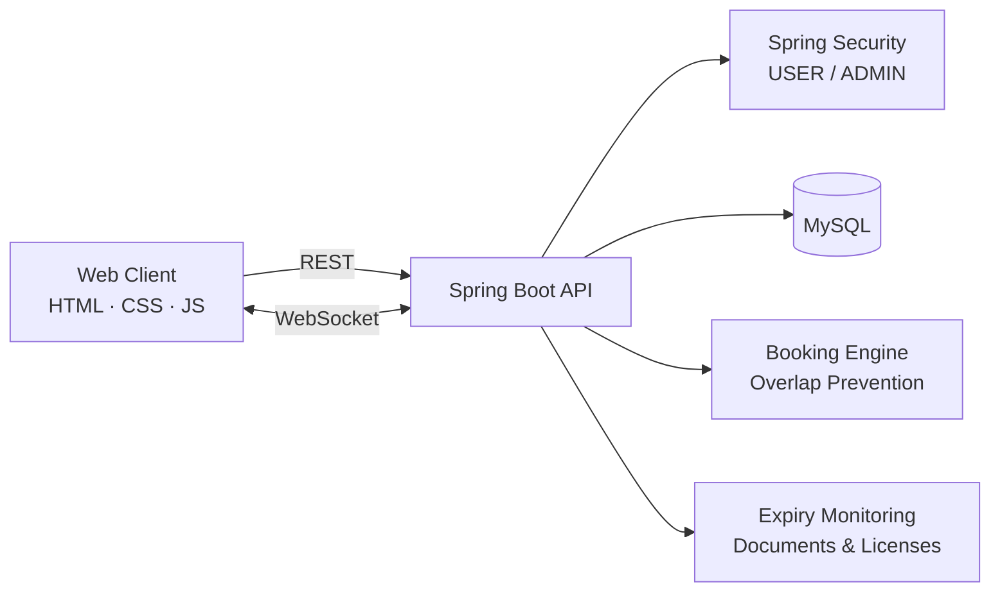
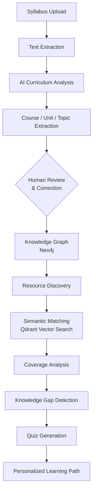

<div align="center">

# Priyadharshini R
<div align="center">


<br/>

**B.E. Artificial Intelligence & Data Science** · Bannari Amman Institute of Technology

*I build complete, deployed applications: secure backends, clean UIs, and applied AI.*

</div>

<br/>

<a href="https://www.linkedin.com/in/priyadharshini-r-dev/"></a>&nbsp;
<a href="https://github.com/Priyadharshini1306"></a>&nbsp;
<a href="https://leetcode.com/u/Priyadharshini1306/"></a>&nbsp;
<a href="mailto:priyarajan1306@gmail.com"></a>

<br/><br/>

<a href="https://car-booking-app-2-46gs.onrender.com/"></a>&nbsp;


</div>

---

## About Me

I'm a **Java Full Stack Developer** and **AI & Data Science** undergraduate who turns ideas into **complete, working, deployed products**, not just tutorial code.

I own the whole pipeline:

```text
Backend  ➜  REST APIs  ➜  Database  ➜  Frontend  ➜  Deployment
```

**What sets me apart:** solid **backend engineering** (secure APIs, role-based access, data integrity) combined with hands-on **applied AI** (RAG pipelines, knowledge graphs, LLM workflows).

### Currently Focused On

| Area | What I'm doing |
|------|----------------|
| **Java & Spring Boot** | Building secure, scalable REST backends |
| **React.js** | Component-driven, responsive UIs |
| **Data Structures & Algorithms** | Regular problem solving on LeetCode |
| **Generative AI** | RAG, LangChain, LangGraph, local LLMs |
| **Cloud & DevOps** | Docker, cloud deployment, CI/CD basics |

---

## Tech Stack

<div align="center">

| | |
|---|---|
| **Languages** |      |
| **Frontend** |     |
| **Backend** |    |
| **Databases** |    |
| **Tools & DevOps** |       |

</div>

**AI / GenAI stack:** `LangChain` · `LangGraph` · `RAG` · `Qdrant (Vector DB)` · `Neo4j (Knowledge Graph)` · `Ollama (Local LLMs)`

---

## Certifications

<div align="center">


**Oracle Certified Professional: Java SE 17 Developer** · 2022

</div>

---

## Featured Projects

### 01 · Car Booking Application
**Full-stack vehicle booking & fleet management platform**

<a href="https://car-booking-app-2-46gs.onrender.com/"></a>&nbsp;
<a href="https://github.com/Priyadharshini1306/car-booking-app"></a>

`Java` `Spring Boot` `Spring Security` `MySQL` `WebSockets` `HTML` `CSS` `JavaScript` `Render`

A complete platform that manages **vehicles, bookings, drivers, users and administrators**, with real-time communication and automated compliance tracking.

<table>
<tr>
<td width="50%" valign="top">

**Security & Access**
- Authentication & authorization
- USER / ADMIN role-based access
- Secure REST APIs with Spring Security

**Booking Engine**
- Advanced vehicle search & filtering
- Hourly and daily booking
- Booking **overlap prevention**
- Driver assignment
- Ratings & feedback system

</td>
<td width="50%" valign="top">

**Operations & Admin**
- Vehicle maintenance management
- Driver shift & leave management
- Vehicle document expiry monitoring
- Driver license expiry monitoring

**Real-Time**
- Live user ↔ admin communication via WebSockets

</td>
</tr>
</table>

**Architecture**



**Engineering highlights**
- Designed booking logic that prevents **double-booking** for the same vehicle and time window
- Separated concerns across controller, service and repository layers
- Deployed end-to-end on **Render** as a live, publicly usable application

---

### 02 · CurriculumMind AI
**AI-powered curriculum analysis & personalized learning platform**


`Python` `FastAPI` `React.js` `LangChain` `LangGraph` `RAG` `Neo4j` `Qdrant` `MongoDB` `Ollama`

An AI system I'm currently building that reads academic syllabus documents and converts them into a **structured knowledge graph**, finds matching learning resources, detects **knowledge gaps**, and generates **quizzes and personalized learning paths**.

**Core Workflow**



**Design highlights**
- **Human-in-the-loop** review step so AI output is corrected before it enters the knowledge graph
- **Hybrid retrieval:** graph relationships (Neo4j) combined with semantic similarity (Qdrant)
- Runs on **local LLMs via Ollama**, so there is no dependency on paid APIs
- Agent-style pipeline orchestrated with **LangGraph**

---

## Roadmap

- [x] Full-stack Java application with security, real-time features and cloud deployment
- [ ] CurriculumMind AI: RAG pipeline, knowledge graph and personalized learning paths *(in progress)*
- [ ] Dockerize and add CI/CD pipelines to all projects
- [ ] Deploy Spring Boot + React architecture on cloud
- [ ] Keep growing on LeetCode (DSA consistency)
- [ ] Contribute to open-source

---

## Let's Connect

I'm looking for **internship and entry-level opportunities** in **Java / Full Stack / AI-enabled development**.

<div align="center">

<a href="https://www.linkedin.com/in/priyadharshini-r-dev/"></a>&nbsp;
<a href="mailto:priyarajan1306@gmail.com"></a>&nbsp;
<a href="https://leetcode.com/u/Priyadharshini1306/"></a>

<br/><br/>

*"Make it work, make it right, make it fast."*

</div>
