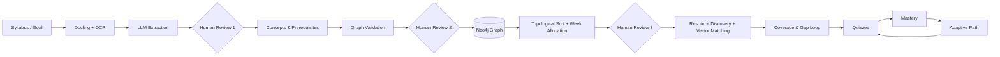
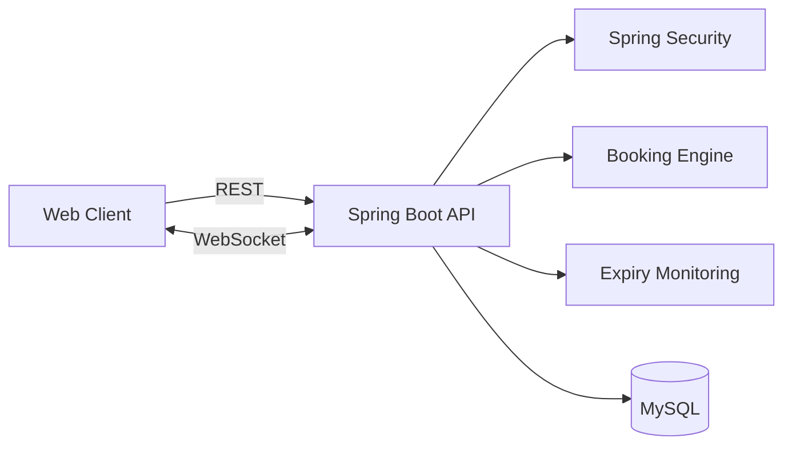

<div align="center">

# Hi, I'm Priyadharshini R 👋


**B.E. Artificial Intelligence & Data Science** · Bannari Amman Institute of Technology
**Oracle Certified Professional: Java SE 17 Developer**

<a href="https://www.linkedin.com/in/priyadharshini-r-dev/"></a>&nbsp;
<a href="mailto:priyarajan1306@gmail.com"></a>&nbsp;
<a href="https://leetcode.com/u/Priyadharshini1306/"></a>&nbsp;


</div>

---

## 🚀 About Me

I build **complete, production-style applications** — from secure backends and database design to polished UIs and AI pipelines — and I test and deploy what I build.

```text
Problem ➜ Architecture ➜ Backend & APIs ➜ Databases ➜ AI Pipeline ➜ Frontend ➜ Tests ➜ Deploy
```

- 🧩 **Backend engineering:** secure REST APIs, JWT & role-based access, data integrity, clean layered architecture
- 🤖 **Applied AI:** LLM pipelines with validated structured output, knowledge graphs, vector search, adaptive systems
- ✅ **Engineering discipline:** unit, integration and end-to-end tests; documented limitations; no secrets in code

---

## ⭐ Featured Projects

### 01 · CurriculumMind AI — Syllabus ➜ Knowledge Graph ➜ Adaptive Study Plan

&nbsp;
<a href="https://github.com/Priyadharshini1306/curriculummind-ai"></a>

`Python` `FastAPI` `React` `Neo4j` `MongoDB` `Groq LLM` `sentence-transformers` `Docling` `NetworkX` `Cytoscape.js` `Tailwind`

Upload a syllabus (PDF, DOCX, PPTX, text or a **scanned image**) or simply describe a learning goal. CurriculumMind builds a **concept knowledge graph with prerequisites**, schedules it into a **week-by-week semester plan**, discovers and ranks **learning resources** for every concept, **quizzes** the learner, and **re-plans the path** around their weak spots.


```mermaid
flowchart LR
    A["Syllabus / Goal"] --> B["Docling + OCR"]
    B --> C["LLM Extraction"]
    C --> V1{"Human Review 1"}
    V1 --> D["Concepts & Prerequisites"]
    D --> G["Graph Validation"]
    G --> V2{"Human Review 2"}
    V2 --> N[("Neo4j Graph")]
    N --> S["Topological Sort + Week Allocation"]
    S --> V3{"Human Review 3"}
    V3 --> R["Resource Discovery + Vector Matching"]
    R --> CV["Coverage & Gap Loop"]
    CV --> Q["Quizzes"]
    Q --> M["Mastery"]
    M --> AP["Adaptive Path"]
    AP --> Q
```

**What makes it engineering-grade**

| | |
|---|---|
| 🛡️ **LLM output is never trusted** | Structured JSON ➜ Pydantic validation (retry with error fed back) ➜ business rules (duplicates, unknown names, cycles, invalid questions dropped) ➜ human review ➜ database |
| 🧠 **Graph algorithms** | Cycle / DAG checks, transitive-edge reduction and orphan detection (NetworkX); topological sort + workload-constrained semester & week allocation |
| 🔎 **Semantic resource matching** | 384-d embeddings stored in **Neo4j vector indexes**; evidence-based coverage %, duplicate detection, heuristic version checks |
| 🔁 **Bounded gap loop** | Targeted re-search for uncovered concepts, capped at 3 iterations, then flagged `UNRESOLVED_GAP` for the instructor |
| 📈 **Adaptive learning loop** | Quiz ➜ per-concept mastery ➜ root-cause prerequisite gaps ➜ reshuffled path ➜ quiz again |
| 🗄️ **Polyglot persistence** | MongoDB Atlas for users, sessions, drafts and quiz history · Neo4j AuraDB for the knowledge graph, linked only by `user_id` |
| 🔐 **Security** | bcrypt, JWTs bound to server-side sessions (real logout), login throttling, upload signature checks, owner-scoped data, instructor-only endpoints, answers never sent before submission |
| ✅ **Tested** | **90 offline unit tests** + integration tests against live services + full-pipeline **E2E tests** through the HTTP API |

**By the numbers:** 3 human-in-the-loop gates · 2 databases · 40+ REST endpoints across 12 modules · 5 input formats incl. OCR · learner & instructor dashboards

---

### 02 · Car Booking Application — Vehicle Booking & Fleet Management

<a href="https://car-booking-app-2-46gs.onrender.com/"></a>&nbsp;
<a href="https://github.com/Priyadharshini1306/car-booking-app"></a>

`Java` `Spring Boot` `Spring Security` `MySQL` `WebSockets` `JavaScript` `Render`

A deployed platform managing **vehicles, bookings, drivers, users and admins**, with real-time messaging and automated compliance tracking.

- 🔐 **USER / ADMIN role-based access** with Spring Security
- 📅 **Booking engine** with hourly/daily booking and **double-booking prevention** for the same vehicle and time window
- 🧑‍✈️ Driver assignment, shifts, leave, ratings and feedback
- ⏰ **Expiry monitoring** for vehicle documents and driver licenses
- ⚡ **Live user ↔ admin chat** over WebSockets
- 🏗️ Layered controller ➜ service ➜ repository design, deployed end-to-end on Render


```mermaid
flowchart LR
    A["Web Client"] -->|REST| B["Spring Boot API"]
    A <-->|WebSocket| B
    B --> C["Spring Security"]
    B --> E["Booking Engine"]
    B --> F["Expiry Monitoring"]
    B --> D[("MySQL")]
```

---

## 🛠️ Tech Stack

| | |
|---|---|
| **Languages** |      |
| **Backend** |     |
| **Frontend** |      |
| **Databases** |    |
| **AI / ML** |      |
| **Testing & DevOps** |      |

---

## 🏆 Certifications

<div align="center">


**Oracle Certified Professional**

</div>

---

## 🗺️ What's Next

- [x] Deployed full-stack Java app with security and real-time features
- [x] CurriculumMind AI: knowledge graph, semester sequencing, resource coverage and adaptive learning loop
- [ ] CurriculumMind AI: Celery + Redis workers, Docker, CI/CD and cloud deployment
- [ ] Spring Boot + React application deployed on cloud
- [ ] Consistent DSA practice on LeetCode · open-source contributions

---

<div align="center">

### 🤝 Let's Connect

Looking for **internship and entry-level roles** in **Java / Full-Stack / AI-enabled development**.

<a href="https://www.linkedin.com/in/priyadharshini-r-dev/"></a>&nbsp;
<a href="mailto:priyarajan1306@gmail.com"></a>

*"Make it work, make it right, make it fast."*

</div>
